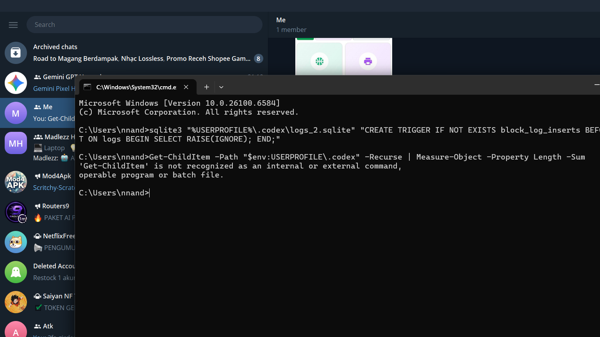
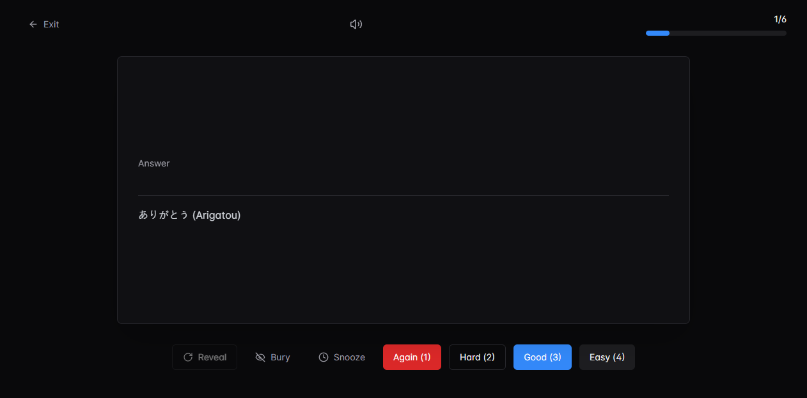
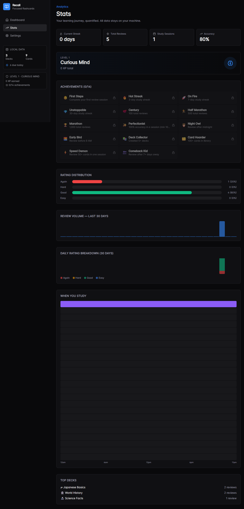

# Recall

[](https://github.com/Madlezz/Recall/actions/workflows/ci.yml)
[](https://github.com/Madlezz/Recall/releases/latest)
[](LICENSE)
[](https://github.com/Madlezz/Recall/releases/latest)

**Recall** is a desktop flashcard app built for focused learning. It uses FSRS-based scheduling for modern spaced repetition, but you just open it and start reviewing. Your data stays on your machine, always.

## 📚 Documentation

- **[Getting Started](docs/getting-started.md)** - New to Recall? Start here
- **[Card Formatting](docs/card-formatting.md)** - Markdown, LaTeX, and code blocks
- **[Accessibility](ACCESSIBILITY.md)** - Keyboard shortcuts and screen reader support
- **[Roadmap](ROADMAP.md)** - Planned features and improvements
- **[Changelog](CHANGELOG.md)** - Version history

---

## Why Recall?

| | Recall | Anki | RemNote / Mochi |
|---|---|---|---|
| Algorithm | **FSRS** (2023, state-of-art) | SM-2 (1987) | Proprietary |
| Storage | **Local SQLite** | Local (custom format) | Cloud |
| Account required | **No** | No | Yes |
| Open source | **Yes** (MIT) | Yes (AGPL) | No |
| Native desktop | **Yes** (Tauri, Rust) | Yes (Qt, Python) | Electron |
| Stack | **React + TypeScript** | Python + Qt | React |

Anki pioneered spaced repetition and has an enormous card ecosystem, but its codebase is
15+ years old and difficult to extend. Cloud alternatives like RemNote require accounts and
subscriptions. Recall fills the gap: a **modern, open-source, privacy-first** desktop app
that implements FSRS — the current scientific standard for spaced repetition — on a maintainable,
contributor-friendly TypeScript stack.

---

## Screenshots







---

## Features

### 🧠 Smart Study
- **FSRS scheduling** — Again / Hard / Good / Easy, the algorithm handles the rest
- **Cloze deletion** — `{{c1::hidden text}}` fill-in-the-blank cards
- **Rich cards** — Markdown, LaTeX, syntax-highlighted code blocks
- **Anki import** — bring your `.apkg` decks
- **CSV import** — upload a spreadsheet, map columns
- **Custom study** — deck, count, tag filter, new-only
- **Card browser** — search, filter, sort, bulk tag/delete/move
- **Tags** — hierarchical tag tree, saved searches, tag autocomplete
- Keyboard-first: `Space` reveal, `1`–`4` rate, `R` to start review, `Ctrl+N` quick-add

### 🎮 Stay Motivated
- **XP & levels** — earn XP per review, climb from Curious Mind to Legend
- **Achievements** — 14 milestones (streaks, volume, accuracy, time-based)
- **Daily goal** — set a target, watch the progress bar, confetti on completion
- **Session summaries** — ratings breakdown, XP earned, achievement unlocks
- **Onboarding gallery** — choose from 4 starter decks (Languages, Coding, GRE, Medical)

### 🧘 Study Tools
- **Focus timer** — Pomodoro with 15/25/45m presets
- **Ambient soundscapes** — Rain, Cafe, Lofi (synthesized locally, zero files)
- **Match game** — turn cards into a tile-matching puzzle
- **Review calendar** — month grid showing study activity heatmap
- **Sound effects** — card flip, correct/incorrect feedback, level-up fanfares

### 📊 Analytics
- **Stats dashboard** — review volume, rating distribution, time-of-day patterns
- **Deck health** — retention %, leeches, overdue per deck
- **Activity heatmap** — GitHub-style contribution graph

### 🔒 Privacy First
- No account, no cloud, no telemetry
- 100% offline — SQLite database on your machine
- JSON export/import — portable and human-readable
- Optional cloud sync — point to any folder (Dropbox, Google Drive, etc.)

### 🎨 Customization
- **6 accent colors** — zinc, blue, green, rose, amber, violet
- **Dyslexia-friendly font** — optional OpenDyslexic/Comic Sans fallback
- **Dark/Light/High-contrast themes** — three themes to match your preference

---

## Quick Start

### Prerequisites

- **Node.js** 22+ and **pnpm** 10+
- **Rust** stable toolchain (`rustup install stable`)
- Platform-specific libraries (see [CONTRIBUTING.md](CONTRIBUTING.md#prerequisites) for full list)

### Run

```bash
pnpm install
pnpm tauri dev       # Full desktop app
# or
pnpm dev             # Browser-only preview (no Rust needed)
```

### Testing

```bash
pnpm test            # Unit tests (165 tests)
pnpm lint            # ESLint
pnpm build           # Production build
pnpm test:e2e        # Playwright E2E (requires `pnpm dev` running first)
```

For full development guide, see [CONTRIBUTING.md](CONTRIBUTING.md).

---

## Download

Pre-built binaries are available on the [Releases page](https://github.com/Madlezz/Recall/releases/latest):

| Platform | File |
|----------|------|
| Windows | `.msi` installer |
| macOS (Apple Silicon) | `.dmg` |
| macOS (Intel) | `.dmg` |
| Linux | `.AppImage` |

Or build from source — see [Quick Start](#quick-start).

---

## Security

Recall is a local-first application — your data never leaves your machine. We take security seriously:

- **Automated auditing**: `cargo audit` (Rust) and Dependabot (JS/TS) run on every CI push
- **CodeQL analysis**: GitHub CodeQL scans for vulnerabilities on every PR
- **Responsible disclosure**: See [SECURITY.md](SECURITY.md) for reporting vulnerabilities

For known transitive vulnerabilities in upstream dependencies, see [SECURITY.md](SECURITY.md).

---

## Keyboard Shortcuts

| Keys | Action |
|------|--------|
| `Space` | Reveal answer |
| `1`–`4` | Rate Again / Hard / Good / Easy |
| `R` | Start review |
| `B` | Bury card |
| `S` | Snooze card |
| `Ctrl+N` | Quick-add card (in-app) |
| `Ctrl+Shift+N` | Quick-add card (global, works when minimized) |
| `Ctrl+Z` | Undo last review |
| `?` | Show all shortcuts |

---

## Contributing

Recall is open to contributions. See [CONTRIBUTING.md](CONTRIBUTING.md) for setup instructions,
project structure, and code style guidelines.

**Looking for a place to start?**
- Browse [`good first issue`](https://github.com/Madlezz/Recall/labels/good%20first%20issue) tags
- Check [ROADMAP.md](ROADMAP.md) for planned features
- Open an issue to discuss before opening a large PR

---

## Tech

| What | With |
|------|------|
| Desktop | Tauri 2 |
| UI | React 19 + TypeScript (strict) |
| Styling | Tailwind CSS + shadcn/ui |
| Storage | SQLite |
| State | Zustand |
| Algorithm | FSRS (ts-fsrs) |
| Icons | Lucide |

---

## License

MIT © [Madlezz](https://github.com/Madlezz)
