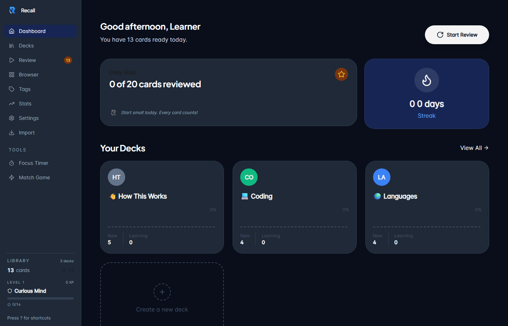
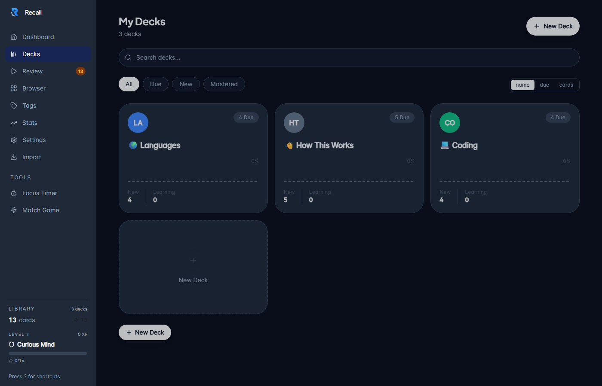
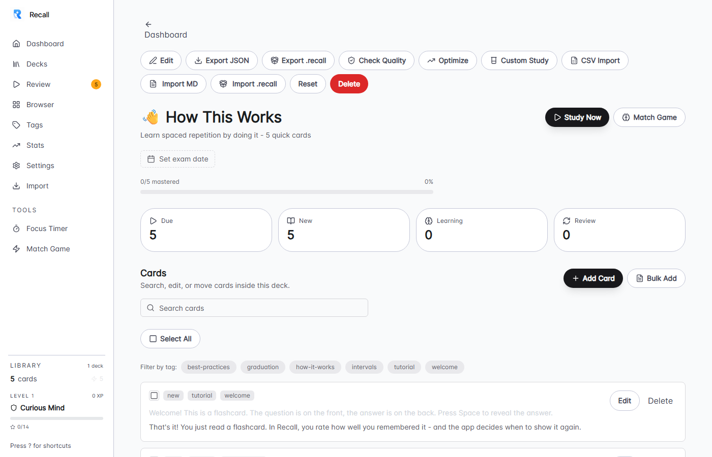
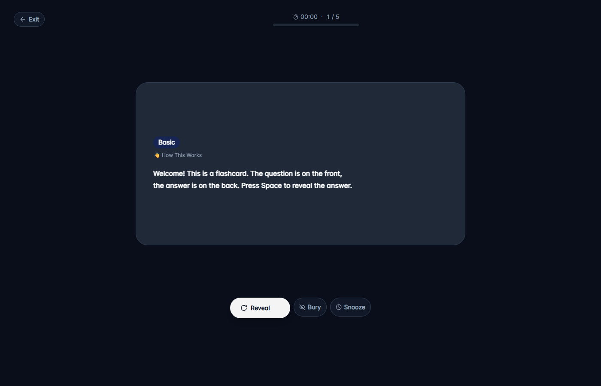
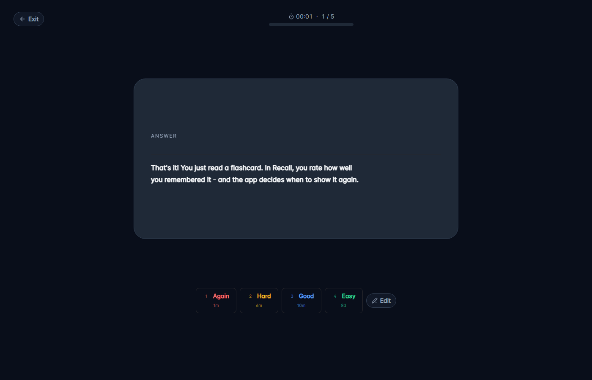
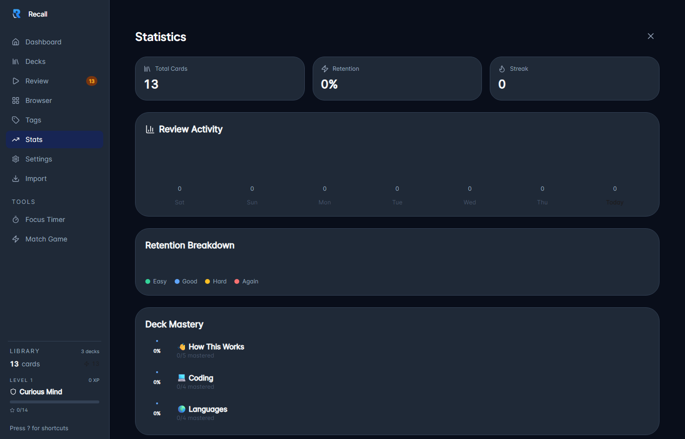
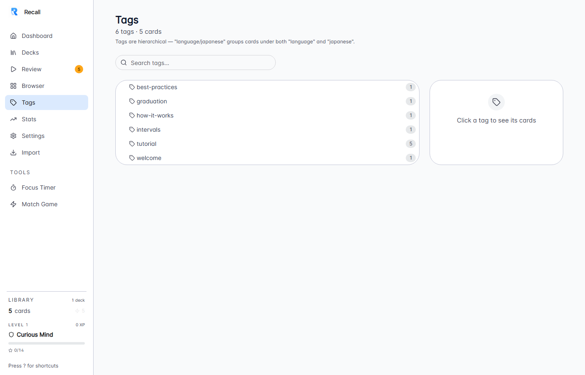
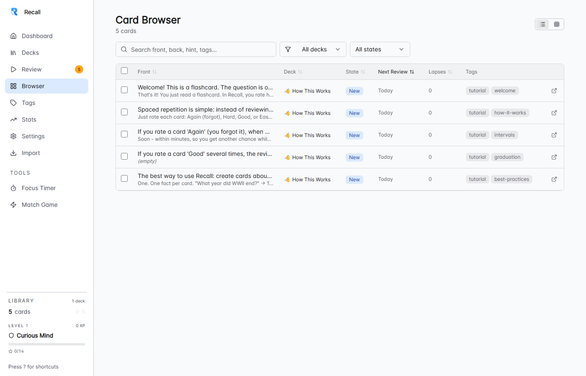
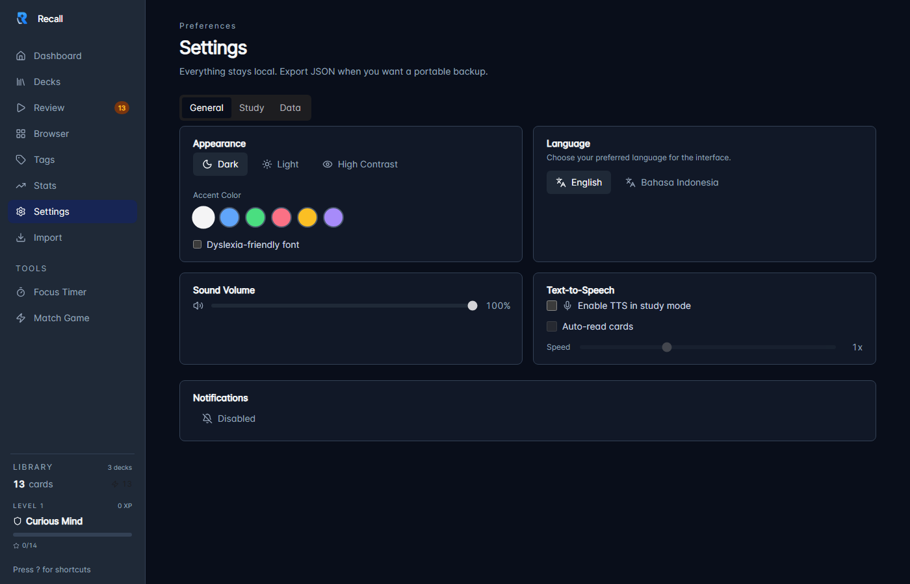

# Recall

[](https://github.com/Madlezz/Recall/actions/workflows/ci.yml)
[](https://github.com/Madlezz/Recall/releases/latest)
[](LICENSE)
[](https://github.com/Madlezz/Recall/releases/latest)

**Recall** is a local-first flashcard app built for focused learning. It uses FSRS-based scheduling for modern spaced repetition — open it and start reviewing. Your data stays on your machine. Available as a desktop app (Windows / macOS / Linux) and a PWA on mobile.

## Documentation

| Doc | What |
|---|---|
| [Getting Started](docs/getting-started.md) | First run, study loop, import |
| [Architecture](docs/ARCHITECTURE.md) | App layers, DB, Tauri vs browser |
| [Sync](docs/SYNC.md) | E2E encrypted relay + folder sync |
| [Deployment](docs/DEPLOYMENT.md) | Releases, PWA Pages, Worker |
| [Card Formatting](docs/card-formatting.md) | Markdown, LaTeX, code, cloze |
| [i18n](docs/i18n.md) | English + Bahasa Indonesia |
| [Accessibility](ACCESSIBILITY.md) | Keyboard + screen reader |
| [Roadmap](ROADMAP.md) | Planned work |
| [Changelog](CHANGELOG.md) | Version history |
| [Contributing](CONTRIBUTING.md) | Dev setup |

---

## Why Recall?

| | Recall | Anki (v26.05) | RemNote | Mochi |
|---|---|---|---|---|
| Algorithm | **FSRS** (default) | FSRS (default for new users) or SM-2 | SM-2 (default) + FSRS option | SM-2 |
| Storage | **Local SQLite** | Local SQLite | Cloud-first (offline cache) | Local files |
| Account required | **No** | No | Yes | No (offline free) |
| Open source | **Yes** (MIT) | Yes (AGPL) | No | No |
| Add-on ecosystem | None (planned) | **Massive** (20+ years) | Plugins | Limited |
| Built-in gamification | **Yes** (XP, levels, achievements) | Via add-ons | Basic | No |
| Native desktop | **Yes** (Tauri, Rust) | Yes (Qt, Python) | Yes (Electron) | Yes (Electron) |
| Mobile access | **PWA** (installable) | AnkiDroid (separate) | Yes | Yes |
| End-to-end encrypted sync | **Yes** (AES-256-GCM) | Via add-on (third-party) | Yes (cloud) | No |
| Swipe gestures | **Yes** | Yes (AnkiDroid) | No | No |
| Stack | **React + TypeScript** | Python + Qt | React | ClojureScript |

Anki pioneered spaced repetition and has an enormous add-on ecosystem. Recall takes a different path: **modern, privacy-first** FSRS by default on a contributor-friendly TypeScript stack, with gamification and focus tools built in.

---

## Screenshots

Dashboard — due cards, daily goal, deck grid:



Deck browser:



Deck detail — stats, tags, card list:



Study — card front:



Study — answer revealed + FSRS interval preview:



Stats — activity, retention, forecast:



Tags — hierarchical tree:



Card browser — search, filter, bulk actions:



Settings — theme, accent, language, TTS:



> Recapture after UI changes: `pnpm dev` in one terminal, then `node scripts/take-screenshots.js`.

---

## Features

### Smart Study
- **FSRS scheduling** — Again / Hard / Good / Easy
- **Cloze deletion** — `{{c1::hidden text}}`
- **Rich cards** — Markdown, LaTeX, syntax-highlighted code
- **Anki import** — `.apkg` (review history + FSRS state)
- **CSV / Markdown / `.recall` import**
- **Custom study** — deck, count, tag filter, new-only
- **Card browser** — search, filter, sort, bulk tag/delete/move
- **Tags** — hierarchical tree, saved searches, autocomplete
- **FSRS interval preview** on rating buttons
- **FSRS optimizer** from review history
- Keyboard-first: `Space` reveal, `1`–`4` rate, `R` review, `Ctrl+N` quick-add

### Stay Motivated
- **XP & levels** — Curious Mind → Legend
- **Achievements** — streaks, volume, accuracy, time-based
- **Daily goal** + confetti on completion
- **Session summaries**
- **Onboarding gallery** — 6 starter decks

### Study Tools
- **Focus timer** — 15 / 25 / 45m
- **Ambient soundscapes** — Rain, Cafe, Lofi (synthesized, no assets)
- **Match game**
- **Review calendar** heatmap
- **Sound effects** + optional TTS
- **Swipe gestures** on mobile
- **Voice input** in card editor (Web Speech API)
- **Command palette** — `Ctrl+K`

### Analytics
- Review volume, rating distribution, time-of-day
- Deck health — retention, leeches, overdue
- Activity heatmap, retention curve, 30-day workload forecast

### Privacy First
- No account, no telemetry by default
- Offline SQLite on your machine
- JSON / `.recall` export
- **E2E encrypted sync** — AES-256-GCM + PBKDF2, sync-code pairing, self-hostable Cloudflare Worker
- Optional folder sync (Dropbox, Drive, etc.)

### Customization
- **6 accent colors** — zinc, blue, green, rose, amber, violet
- **Dyslexia-friendly font**
- **Dark / Light / High-contrast**
- **English + Bahasa Indonesia**

---

## Quick Start

### Prerequisites

- **Node.js** 22+ (dev pin: `.node-version` → 24.18.0) and **pnpm** 10+
- **Rust** stable (`rustup install stable`) for desktop builds
- Platform libraries — see [CONTRIBUTING.md](CONTRIBUTING.md#prerequisites)

### Run

```bash
pnpm install
pnpm tauri dev       # Desktop (Tauri)
# or
pnpm dev             # Browser preview (no Rust)
```

### PWA

Installable PWA: **https://madlezz.github.io/Recall**

Swipe left / right / up / down to rate after reveal.

### Testing

```bash
pnpm test            # Unit tests (776)
pnpm lint            # ESLint
pnpm build           # tsc + Vite production build
pnpm test:e2e        # Playwright (starts `pnpm dev` via config)
```

---

## Download

Pre-built binaries on [Releases](https://github.com/Madlezz/Recall/releases/latest) (latest: **v1.1.0**):

| Platform | File |
|----------|------|
| Windows | `.msi` |
| macOS (Apple Silicon) | `.dmg` |
| macOS (Intel) | `.dmg` |
| Linux | `.AppImage` |

Or build from source — [Quick Start](#quick-start).

---

## Security

Local-first: card data stays on device unless you enable sync.

- **CI audits**: `cargo audit`, Dependabot, CodeQL on push/PR
- **Disclosure**: [SECURITY.md](SECURITY.md)

Sync codes are E2E key material — never put them in exports or screenshots.

---

## Keyboard Shortcuts

| Keys | Action |
|------|--------|
| `Space` | Reveal answer |
| `1`–`4` | Again / Hard / Good / Easy |
| `R` | Start review |
| `B` | Bury card |
| `S` | Snooze card |
| `Ctrl+N` | Quick-add (in-app) |
| `Ctrl+Shift+N` | Quick-add (global, desktop) |
| `Ctrl+Z` | Undo last review |
| `Ctrl+K` | Command palette |
| `T` | Toggle TTS |
| `?` | All shortcuts |

---

## Contributing

See [CONTRIBUTING.md](CONTRIBUTING.md).

- [`good first issue`](https://github.com/Madlezz/Recall/labels/good%20first%20issue)
- [ROADMAP.md](ROADMAP.md)
- Open an issue before large PRs

---

## Tech

| What | With |
|------|------|
| Desktop | Tauri 2 + Rust (rusqlite) |
| Mobile | PWA (`vite-plugin-pwa`) |
| UI | React 19 + TypeScript (strict) |
| Styling | Tailwind CSS + shadcn/ui primitives |
| Browser storage | Dexie |
| Desktop storage | SQLite via Tauri |
| State | Zustand |
| Algorithm | FSRS (`ts-fsrs`) |
| Sync | AES-256-GCM + PBKDF2, Cloudflare Worker relay |
| i18n | react-i18next |
| Icons | Lucide |

---

## License

MIT © [Madlezz](https://github.com/Madlezz)
