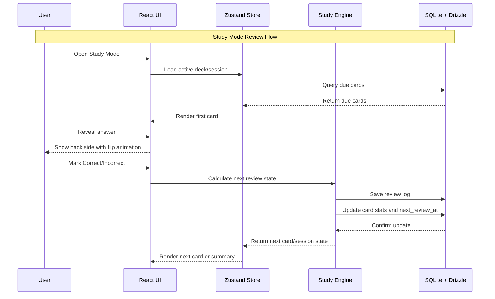
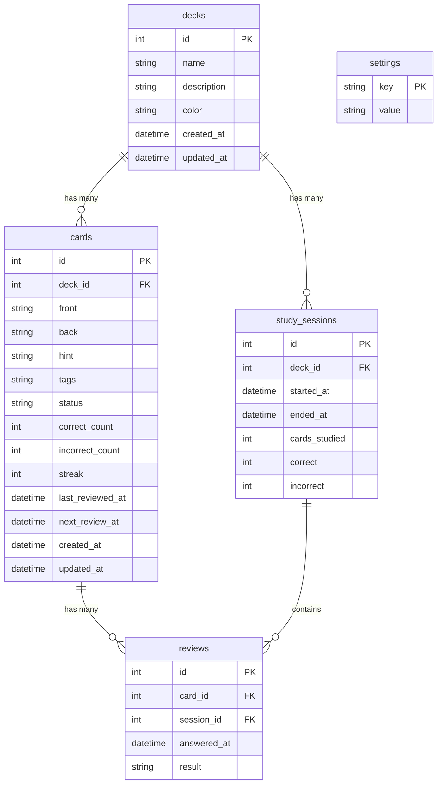

# PRD — Recall

## 1. Overview

**Recall** adalah aplikasi flashcard desktop yang minimal, local-first, dan dirancang untuk pembelajaran fokus tanpa ketergantungan cloud.

**Tagline:**  
*A minimal, local-first flashcard app for focused learning.*

Aplikasi ini ditujukan untuk pengguna tunggal, terutama developer dan pelajar teknis yang ingin memiliki tool belajar ringan, cepat, dan sepenuhnya lokal. Recall tidak membutuhkan akun, login, koneksi internet, layanan cloud, ataupun sinkronisasi eksternal. Saat aplikasi dibuka, pengguna langsung masuk ke dashboard dan dapat mulai membuat deck, menambahkan kartu, serta melakukan review.

Masalah utama yang ingin diselesaikan adalah kebutuhan akan aplikasi flashcard yang sederhana, portable, offline, dan tidak terlalu kompleks seperti Anki, tetapi tetap memiliki fitur penting seperti progress tracking, spaced repetition sederhana, import/export, dan study mode yang nyaman digunakan dengan keyboard.

Tujuan utama MVP adalah menyediakan desktop app yang dapat digunakan untuk:
- membuat dan mengelola deck;
- membuat dan mengelola flashcard;
- belajar dengan mode self-assessment;
- melacak progress kartu;
- melakukan review berdasarkan due date sederhana;
- memindahkan data antar komputer melalui file database atau export JSON.

## 2. Requirements

Berikut adalah persyaratan tingkat tinggi untuk pengembangan Recall:

- **Platform:** Aplikasi desktop menggunakan Tauri.
- **Frontend:** React 18, TypeScript strict, dan Vite.
- **Storage:** SQLite lokal menggunakan Drizzle ORM.
- **Mode penggunaan:** Satu user lokal, tanpa login.
- **Offline-first:** Aplikasi harus bisa berjalan 100% offline selamanya.
- **No cloud dependency:** Tidak ada cloud sync, akun, server eksternal, ataupun API online.
- **No telemetry:** Tidak boleh ada analytics, tracking, telemetry, crash reporting eksternal, atau pengiriman data pengguna.
- **Portability:** Data dapat dipindahkan antar komputer dengan menyalin file `.db` atau menggunakan export/import JSON.
- **UI language:** Bahasa antarmuka menggunakan bahasa Inggris.
- **Terminology:** Istilah teknis tetap menggunakan Deck, Card, dan Review.
- **Design direction:** Minimalis, clean, serius, mirip Linear; bukan playful.
- **Theme:** Default dark mode, dengan toggle light/dark.
- **Font:** Inter, harus di-bundle lokal.
- **No external CDN:** Semua asset, font, dan dependency harus tersedia secara lokal melalui bundle aplikasi.
- **Open-source readiness:** Repo bernama `recall`, menggunakan lisensi MIT, dan memiliki README polished serta CONTRIBUTING.md singkat.

## 3. Core Features

Fitur-fitur utama yang harus ada dalam MVP:

### 3.1 Dashboard

Dashboard adalah halaman pertama saat aplikasi dibuka.

Dashboard harus menampilkan:
- daftar deck;
- progress bar per deck berdasarkan jumlah kartu mastered dibanding total kartu;
- jumlah cards due today secara aggregate;
- study streak harian;
- tombol quick action:
  - **Start Review**
  - **New Deck**

Dashboard tidak menampilkan grafik pada MVP.

### 3.2 Deck Management

Pengguna dapat membuat, melihat, mengedit, dan menghapus deck.

Field deck:
- `name` — wajib, unik;
- `description` — opsional;
- `color` — pilihan dari preset warna, bukan custom hex;
- `created_at`;
- `updated_at`.

Aturan deck:
- Deck hanya satu level.
- Tidak ada folder.
- Tidak ada subdeck.
- Tidak ada archive.
- Tidak ada merge deck.
- Tidak ada duplicate deck di MVP.
- Delete deck bersifat permanen.
- Delete deck wajib menggunakan confirmation modal.
- Satu card hanya bisa berada di satu deck.

### 3.3 Card Management

Pengguna dapat membuat, melihat, mengedit, menghapus, mencari, dan memindahkan kartu antar deck.

Field card:
- `front` — wajib;
- `back` — wajib;
- `hint` — opsional;
- `tags` — JSON array;
- `status` — otomatis: `new`, `learning`, atau `mastered`;
- `correct_count`;
- `incorrect_count`;
- `streak`;
- `last_reviewed_at`;
- `next_review_at`;
- `created_at`;
- `updated_at`.

Aturan card:
- MVP hanya mendukung basic front/back flashcard.
- Jawaban menggunakan self-assessment, bukan typed answer.
- Image, audio, LaTeX, multiple choice, dan cloze deletion tidak masuk MVP.
- Card dapat dipindahkan antar deck.
- Search teks sederhana tersedia di dalam halaman Deck Detail.

### 3.4 Study Mode

Study Mode adalah mode fullscreen dengan kartu besar di tengah layar.

Flow belajar:
1. User memilih deck atau menekan Start Review.
2. Sistem menampilkan kartu pertama.
3. User melihat sisi front.
4. User menekan reveal untuk melihat back.
5. User memilih:
   - **Correct**
   - **Incorrect**
6. Sistem memperbarui progress kartu.
7. Sistem lanjut ke kartu berikutnya.
8. Setelah sesi selesai, sistem menampilkan summary.

Elemen Study Mode:
- fullscreen layout;
- card besar di tengah;
- animasi flip card;
- progress indicator, misalnya `7/20`;
- keyboard shortcuts:
  - `Space` untuk reveal;
  - `1` untuk Incorrect;
  - `2` untuk Correct.

Summary setelah sesi selesai:
- total kartu dijawab;
- jumlah benar;
- jumlah salah;
- accuracy sesi.

### 3.5 Simple Spaced Repetition

MVP menggunakan spaced repetition sederhana, bukan SM-2 penuh.

Aturan:
- Jika jawaban **Incorrect**:
  - `streak` reset ke `0`;
  - `incorrect_count` bertambah;
  - `next_review_at` menjadi besok.
- Jika jawaban **Correct**:
  - `streak` bertambah;
  - `correct_count` bertambah;
  - interval review dikali 2, dimulai dari 1 hari.
- Status otomatis:
  - `new`: belum pernah direview;
  - `learning`: sudah direview tapi belum mastered;
  - `mastered`: benar 5 kali berturut-turut tanpa salah.
- Tidak ada pengaturan interval manual oleh user.
- Tidak ada mode Again/Hard/Good/Easy di MVP.

### 3.6 Deck Detail

Halaman Deck Detail menampilkan informasi dan kartu dalam satu deck.

Konten halaman:
- nama deck;
- deskripsi deck;
- accuracy deck;
- jumlah kartu;
- jumlah mastered cards;
- jumlah due cards;
- tombol **Study Now**;
- card list;
- search teks sederhana dalam deck.

Deck stats dihitung secara dinamis dari data cards dan reviews.

### 3.7 Import & Export

Import/export wajib ada dalam MVP.

Format:
- JSON saja.

Export:
- export semua data ke satu file JSON;
- mencakup deck, cards, dan progress stats.

Import:
- user dapat memilih file JSON;
- tersedia dua mode:
  - **Replace:** hapus semua data lokal, lalu ganti dengan data import;
  - **Merge:** tambahkan deck/card baru, skip duplicate.

Duplicate rule saat merge:
- duplicate dicek berdasarkan kombinasi:
  - deck name;
  - card front.

Error handling:
- jika file import rusak atau tidak valid, tampilkan error toast;
- import harus rollback sepenuhnya;
- tidak boleh ada partial import.

Tidak masuk MVP:
- Anki compatibility;
- CSV import/export;
- Markdown import/export;
- preview import.

### 3.8 Settings

Halaman Settings berisi:
- light/dark theme toggle;
- reset all data;
- export data;
- import data.

Reset all data:
- wajib menggunakan confirmation modal;
- setelah reset, data aplikasi kembali kosong atau ke seed state sesuai implementasi awal.

### 3.9 Seed Data

Aplikasi wajib memiliki seed/demo data agar reviewer dapat mencoba aplikasi tanpa membuat kartu dari nol.

Seed data minimal:
- beberapa deck contoh;
- beberapa kartu contoh;
- progress awal yang cukup untuk menampilkan dashboard, deck detail, dan study mode.

## 4. User Flow

### 4.1 First Launch Flow

1. User membuka Recall.
2. Aplikasi langsung masuk ke Dashboard.
3. Dashboard menampilkan seed data.
4. User melihat deck list, progress, due cards, dan study streak.
5. User dapat langsung menekan **Start Review** atau membuat deck baru.

### 4.2 Create Deck Flow

1. User menekan tombol **New Deck**.
2. Sistem membuka form deck.
3. User mengisi:
   - name;
   - description opsional;
   - color preset.
4. User menyimpan deck.
5. Sistem memvalidasi bahwa nama deck tidak kosong dan unik.
6. Deck baru muncul di dashboard.

### 4.3 Create Card Flow

1. User membuka Deck Detail.
2. User menekan tombol tambah card.
3. User mengisi:
   - front;
   - back;
   - hint opsional;
   - tags opsional.
4. User menyimpan card.
5. Sistem memvalidasi bahwa front dan back tidak kosong.
6. Card muncul di card list.

### 4.4 Study Flow

1. User membuka deck dan menekan **Study Now**, atau menekan **Start Review** dari dashboard.
2. Sistem mengambil kartu yang due.
3. Study Mode tampil fullscreen.
4. User melihat front card.
5. User menekan `Space` atau tombol reveal.
6. Back card tampil dengan animasi flip.
7. User menekan:
   - `1` untuk Incorrect;
   - `2` untuk Correct.
8. Sistem menyimpan review.
9. Sistem memperbarui stats card dan next review date.
10. Setelah semua kartu selesai, sistem menampilkan session summary.

### 4.5 Export Flow

1. User membuka Settings.
2. User menekan **Export Data**.
3. Sistem membuat file JSON.
4. User menyimpan file tersebut secara lokal.

### 4.6 Import Flow

1. User membuka Settings.
2. User menekan **Import Data**.
3. User memilih file JSON.
4. Sistem menampilkan pilihan:
   - Replace;
   - Merge.
5. Sistem memvalidasi struktur file.
6. Jika valid, sistem melakukan import.
7. Jika gagal, sistem rollback dan menampilkan error toast.

### 4.7 Demo Flow

Demo utama MVP:

1. Buka app.
2. Lihat seed data di dashboard.
3. Buat deck baru.
4. Tambah 3 kartu.
5. Jalankan study mode.
6. Jawab beberapa kartu.
7. Lihat summary.
8. Export JSON.

Demo flow ini menjadi definisi keberhasilan versi pertama.

## 5. Architecture

Recall menggunakan arsitektur desktop local-first berbasis Tauri.

Komponen utama:
- **Tauri Desktop Shell:** Menyediakan wrapper desktop dan akses ke fitur lokal.
- **React Frontend:** Menangani UI, routing, state, form, dan interaksi pengguna.
- **Zustand Store:** Menyimpan state global ringan seperti deck list dan active study session.
- **SQLite Database:** Menyimpan semua data lokal.
- **Drizzle ORM:** Mengelola schema, query, dan migration.
- **Import/Export Service:** Menangani serialization dan deserialization data JSON.
- **Study Engine:** Menangani logika spaced repetition sederhana.



## 6. Database Schema

Berikut adalah struktur database utama untuk MVP.



### 6.1 Table Descriptions

| Table | Description |
|---|---|
| `decks` | Menyimpan data deck seperti nama, deskripsi, warna, dan timestamp. |
| `cards` | Menyimpan flashcard, progress, status, review counters, tags, dan due date. |
| `study_sessions` | Menyimpan ringkasan sesi belajar. |
| `reviews` | Menyimpan log jawaban per kartu dalam sesi belajar. |
| `settings` | Menyimpan konfigurasi lokal seperti theme dan schema version. |

### 6.2 Data Rules

- `decks.name` harus unik.
- `cards.front` dan `cards.back` wajib diisi.
- `cards.tags` disimpan sebagai JSON string.
- `cards.status` hanya boleh bernilai:
  - `new`;
  - `learning`;
  - `mastered`.
- `reviews.result` hanya boleh bernilai:
  - `correct`;
  - `incorrect`.
- Aggregate stats disimpan langsung di card untuk performa.
- Deck stats dihitung dinamis dari join/query.
- Schema version disimpan di table `settings`.

## 7. Design & Technical Constraints

### 7.1 Technology Stack

MVP harus menggunakan stack berikut:

- Tauri
- React 18
- TypeScript strict
- Vite
- SQLite via `@tauri-apps/plugin-sql`
- Drizzle ORM
- Tailwind CSS
- shadcn/ui
- Zustand
- Lucide icons
- date-fns
- pnpm
- Node.js minimum 18

### 7.2 Development Constraints

- Package manager wajib menggunakan `pnpm`.
- TypeScript strict wajib aktif.
- ESLint cukup menggunakan default Vite.
- Tidak perlu konfigurasi linting kompleks.
- Migration system menggunakan Drizzle.
- Tidak perlu test otomatis untuk MVP.
- Manual QA checklist wajib tersedia.
- Seed/demo data wajib tersedia.
- Aplikasi harus bisa dijalankan dengan:

```bash
pnpm install
pnpm tauri dev
```

### 7.3 Local-First Constraints

- Aplikasi harus bisa berjalan tanpa internet.
- Tidak boleh menggunakan CDN eksternal.
- Tidak boleh menggunakan cloud API.
- Tidak boleh ada login.
- Tidak boleh ada telemetry.
- Tidak boleh ada tracking.
- Font harus di-bundle lokal.
- Data harus tersimpan secara lokal di SQLite.
- Data dapat dipindahkan dengan copy file `.db`.

### 7.4 UI Constraints

- Style minimalis, clean, serius, mirip Linear.
- Default theme adalah dark mode.
- Light/dark toggle tersedia di Settings.
- Font utama: Inter bundled.
- Study card harus tampil besar dan fokus di tengah layar.
- Empty states harus rapi dan membantu.
- Toast notifications harus tersedia untuk feedback aksi penting.
- Confirmation modal wajib untuk aksi destructive:
  - delete deck;
  - reset all data;
  - replace import.

## 8. Non-Goals

Fitur berikut tidak masuk MVP:

- image support;
- audio support;
- LaTeX;
- multiple choice;
- cloze deletion;
- typed-answer mode;
- tags di level deck;
- subdeck;
- folder;
- command palette;
- analytics page;
- charts;
- reminder;
- desktop notification;
- duplicate deck;
- bulk operations;
- global search lintas deck;
- calendar review;
- password;
- encryption;
- i18n;
- cloud sync;
- account/login;
- telemetry;
- Anki compatibility;
- CSV import/export;
- Markdown import/export;
- automated tests.

## 9. Acceptance Criteria

### 9.1 Dashboard

Dashboard dianggap selesai jika:
- tampil saat aplikasi pertama dibuka;
- menampilkan daftar deck;
- menampilkan progress mastered/total per deck;
- menampilkan cards due today;
- menampilkan study streak;
- memiliki tombol Start Review;
- memiliki tombol New Deck;
- tampil baik dalam dark mode default.

### 9.2 Deck CRUD

Deck CRUD dianggap selesai jika:
- user dapat membuat deck baru;
- user dapat mengedit deck;
- user dapat menghapus deck dengan confirmation modal;
- nama deck wajib diisi;
- nama deck harus unik;
- deck muncul di dashboard setelah dibuat;
- perubahan deck tersimpan di SQLite.

### 9.3 Card CRUD

Card CRUD dianggap selesai jika:
- user dapat membuat card;
- user dapat mengedit card;
- user dapat menghapus card;
- user dapat memindahkan card ke deck lain;
- front dan back wajib diisi;
- hint opsional;
- tags tersimpan sebagai JSON array/string;
- card muncul di Deck Detail;
- card dapat dicari melalui search dalam deck.

### 9.4 Study Mode

Study Mode dianggap selesai jika:
- user dapat memulai sesi dari deck;
- card tampil fullscreen dengan layout fokus;
- user dapat reveal jawaban;
- animasi flip card berjalan;
- user dapat memilih Correct atau Incorrect;
- shortcut Space, 1, dan 2 berfungsi;
- progress indicator tampil;
- review tersimpan ke database;
- summary tampil setelah sesi selesai.

### 9.5 Spaced Repetition

Spaced repetition dianggap selesai jika:
- card baru memiliki status `new`;
- jawaban Correct menambah `correct_count` dan `streak`;
- jawaban Incorrect menambah `incorrect_count` dan reset `streak`;
- Incorrect membuat card due besok;
- Correct membuat interval berikutnya dikali 2 mulai dari 1 hari;
- card menjadi `mastered` setelah benar 5 kali berturut-turut;
- `last_reviewed_at` dan `next_review_at` diperbarui.

### 9.6 Import/Export

Import/export dianggap selesai jika:
- user dapat export semua data ke JSON;
- file JSON berisi deck, card, dan progress stats;
- user dapat import JSON dengan mode Replace;
- user dapat import JSON dengan mode Merge;
- duplicate saat merge di-skip berdasarkan deck name + card front;
- file rusak menampilkan error toast;
- import gagal melakukan rollback;
- tidak ada partial import.

### 9.7 Settings

Settings dianggap selesai jika:
- user dapat toggle light/dark theme;
- user dapat reset all data;
- reset all data menggunakan confirmation modal;
- user dapat export data;
- user dapat import data.

### 9.8 Open Source Readiness

Project dianggap open-source-ready jika:
- repo bernama `recall`;
- menggunakan lisensi MIT;
- README menjelaskan cara install dan run;
- README memiliki no-telemetry statement;
- README memiliki roadmap singkat;
- README memiliki screenshot;
- tersedia CONTRIBUTING.md singkat;
- tersedia manual QA checklist.

## 10. Manual QA Checklist

Checklist minimal sebelum MVP dianggap selesai:

- [ ] App bisa dibuka dengan `pnpm tauri dev`.
- [ ] App tetap bisa digunakan tanpa internet.
- [ ] Dashboard tampil dengan seed data.
- [ ] User bisa membuat deck baru.
- [ ] User tidak bisa membuat deck dengan nama kosong.
- [ ] User tidak bisa membuat deck dengan nama duplicate.
- [ ] User bisa mengedit deck.
- [ ] User bisa menghapus deck dengan confirmation modal.
- [ ] User bisa membuat card.
- [ ] User tidak bisa membuat card tanpa front/back.
- [ ] User bisa mengedit card.
- [ ] User bisa menghapus card.
- [ ] User bisa memindahkan card antar deck.
- [ ] Search dalam deck berfungsi.
- [ ] Study Mode bisa dimulai.
- [ ] Space untuk reveal berfungsi.
- [ ] Shortcut 1 untuk Incorrect berfungsi.
- [ ] Shortcut 2 untuk Correct berfungsi.
- [ ] Card flip animation berjalan.
- [ ] Correct memperbarui card stats.
- [ ] Incorrect memperbarui card stats.
- [ ] Mastered tercapai setelah 5 correct streak.
- [ ] Session summary tampil.
- [ ] Export JSON berhasil.
- [ ] Import Replace berhasil.
- [ ] Import Merge berhasil.
- [ ] Import file rusak menampilkan error toast.
- [ ] Import gagal tidak merusak data lama.
- [ ] Theme toggle berfungsi.
- [ ] Reset all data berfungsi dengan confirmation modal.
- [ ] README tersedia.
- [ ] MIT license tersedia.
- [ ] CONTRIBUTING.md tersedia.

## 11. Future Roadmap

Fitur yang dapat dipertimbangkan setelah MVP:

- Image support.
- Audio support.
- LaTeX rendering.
- Cloze deletion.
- Multiple choice cards.
- Typed-answer mode.
- Global search.
- Bulk card operations.
- Duplicate deck.
- Analytics page.
- Review calendar.
- Advanced spaced repetition algorithm.
- Anki import/export compatibility.
- CSV import/export.
- Markdown import/export.
- Optional encryption.
- Optional password protection.
- Optional i18n.
- Optional command palette.
- Optional desktop reminders.

## 12. AI Coding Prompt

Gunakan prompt berikut untuk menghasilkan implementasi awal:

```text
Build a desktop app called Recall.

Recall is a minimal, local-first flashcard app for focused learning.

Tech stack:
- Tauri
- React 18
- TypeScript strict
- Vite
- SQLite via @tauri-apps/plugin-sql
- Drizzle ORM
- Tailwind CSS
- shadcn/ui
- Zustand
- Lucide icons
- date-fns
- pnpm
- Node.js >= 18

Core requirements:
- Single local user
- No login
- No cloud
- No telemetry
- 100% offline
- No external CDN
- Inter font bundled locally
- Default dark mode with light/dark toggle

MVP pages:
1. Dashboard
2. Deck Detail
3. Study Mode
4. Settings

Features:
- Deck CRUD
- Card CRUD
- Move card between decks
- Search cards inside a deck
- Study mode with self-assessment
- Correct/Incorrect answers only
- Simple spaced repetition
- Progress tracking
- Session summary
- Import/export JSON
- Seed/demo data
- Toast notifications
- Empty states
- Confirmation modals for destructive actions
- Keyboard shortcuts in study mode:
  - Space = reveal
  - 1 = Incorrect
  - 2 = Correct

Database tables:
- decks
- cards
- study_sessions
- reviews
- settings

Spaced repetition:
- Incorrect: reset streak, increment incorrect_count, next_review_at = tomorrow
- Correct: increment streak and correct_count, next interval doubles starting from 1 day
- Mastered: card becomes mastered after 5 correct answers in a row
- No SM-2
- No Again/Hard/Good/Easy

Import/export:
- JSON only
- Export all data
- Import modes: replace or merge
- Merge skips duplicates by deck name + card front
- Invalid import must show error toast and rollback fully

Do not implement:
- login
- cloud sync
- telemetry
- image/audio
- LaTeX
- multiple choice
- cloze deletion
- typed answer
- analytics page
- reminders
- global search
- bulk operations
- i18n
- encryption
- Anki compatibility

Open-source:
- repo name: recall
- MIT license
- polished README
- CONTRIBUTING.md
- no-telemetry statement
- short roadmap
- manual QA checklist

Keep the code simple, modular, and maintainable.
Prioritize a working MVP over over-engineering.
```
